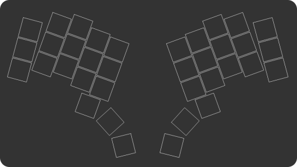

# Ergogen    [![Badge License]][License]

***Keyboard Generator*** *build on* ***[Absolem Keyboard]***.

 

The project aims to provide a common configuration format to  
describe ***ergonomic*** 2D layouts and generate automatic plates,  
cases, as well as un-routed PCBs for them.

 
 

---

[![Button Demo]][Demo]   
[![Button Getting Started]][Getting Started]   
[![Button Documentation]][Documentation]   
[![Button Discord]][Discord]

---

 
 

## Contributions

Feature ideas, documentation improvements,  
examples, tests, or pull requests welcome!

*Get in touch on our **[Discord]**, and we can definitely*  
*find something you can help with, if you'd like to.*

 

<!----------------------------------------------------------------------------->

[Badge License]: https://img.shields.io/badge/License-MIT-yellow.svg?style=for-the-badge

[Absolem Keyboard]: https://zealot.hu/absolem
[Getting Started]: docs/Getting%20Started.md
[Documentation]: https://docs.ergogen.xyz
[Discord]: https://discord.gg/nbKcAZB
[Demo]: https://ergogen.xyz

[License]: LICENSE

<!--------------------------------{ Buttons }---------------------------------->

[Button Getting Started]: https://img.shields.io/badge/Getting_Started-F94877?style=for-the-badge&logoColor=white&logo=GitHub
[Button Documentation]: https://img.shields.io/badge/Documentation-1793D1?style=for-the-badge&logoColor=white&logo=GitBook
[Button Discord]: https://img.shields.io/badge/Discord-5865F2?style=for-the-badge&logoColor=white&logo=Discord
[Button Demo]: https://img.shields.io/badge/Demo-37a779?style=for-the-badge&logoColor=white&logo=AppleArcade
