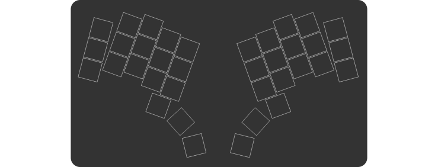

# Ergogen

***Ergonomic Keyboard Generator***

 

The project aims to provide a common configuration format to describe ***ergonomic*** 2D layouts and generate automatic plates, cases, as well as un-routed PCBs for them. The project grew out of (and is an integral part of) the [Absolem keyboard], and shares its [Discord] server as well.

 
 
 

---

[![Button WebUI]][WebUI]
[![Button Documentation]][Documentation]
[![Button Discord]][Discord]
[![Button Donate]][Donate]

---

 
 

## Getting Started

Until there's a proper "Getting started" guide, try getting acquainted with **Ergogen** by following these steps in order:

 

1. Read the **[Documentation]**.
    
    D'uuh.
    They're not complete by any measure, but should give you a fairly good idea what you're dealing with here.

     
    
2. Try one of the web-based deployments.

    [![Button Official]][WebUI]   
    [![Button Unofficial]][Unofficial]
   
    The unofficial deployment is probably better, tbh, and will soon be replacing the official one.
    Choose either one, then click things, look at outputs and see if things start to make sense.
   
    There is no need for you to download the **CLI** unless you want to do one of the following:
   
    - Preview in-development features
    - Use custom modifications
    - Contribute code
   
     

3. Search the [`ergogen`][Topic] topic on GitHub.

    There, you can look at (and reverse engineer) a variety of real life configs using **Ergogen**.
    Pop them into the web UI to see what they do, tinker with them and things should start to make more sense.

     

4. If a question persists after all of the above, feel free to ask it over on **[Discord]** and we'll do our best to help you out.

 

## Contributions

Feature ideas, documentation improvements, examples, tests, or pull requests welcome!
Get in touch on our **[Discord]**, and we can definitely find something you can help with, if you'd like to.

 

## Sponsors

Huge thanks go to everyone who chooses to support my work!
But even huger thanks are due to the following, *distinguished* sponsors:

- [perce](https://madebyperce.com/)
- [Cache](https://github.com/MvEerd)
- [Neil Gilmour](https://github.com/neilgilmour)
- [ochief](https://github.com/ochief)
- [Alyx Brett](https://github.com/alyx-brett)

<!----------------------------------------------------------------------------->

[Absolem keyboard]: https://zealot.hu/absolem
[Documentation]: https://docs.ergogen.xyz
[Discord]: http://discord.ergogen.xyz
[WebUI]: https://ergogen.xyz
[Unofficial]: https://ergogen.cache.works/
[Topic]: https://github.com/topics/ergogen
[Donate]: https://github.com/sponsors/mrzealot

<!--------------------------------{ Buttons }---------------------------------->

[Button WebUI]: https://img.shields.io/badge/Deployment-37a779?style=for-the-badge&logoColor=white&logo=AppleArcade
[Button Unofficial]: https://img.shields.io/badge/Unofficial-yellow?style=for-the-badge
[Button Official]: https://img.shields.io/badge/Official-37a779?style=for-the-badge
[Button Documentation]: https://img.shields.io/badge/Documentation-1793D1?style=for-the-badge&logoColor=white&logo=GitBook
[Button Discord]: https://img.shields.io/badge/Discord-5865F2?style=for-the-badge&logoColor=white&logo=Discord
[Button Donate]: https://img.shields.io/badge/Donate-EA4AAA?style=for-the-badge&logoColor=white&logo=githubsponsors
